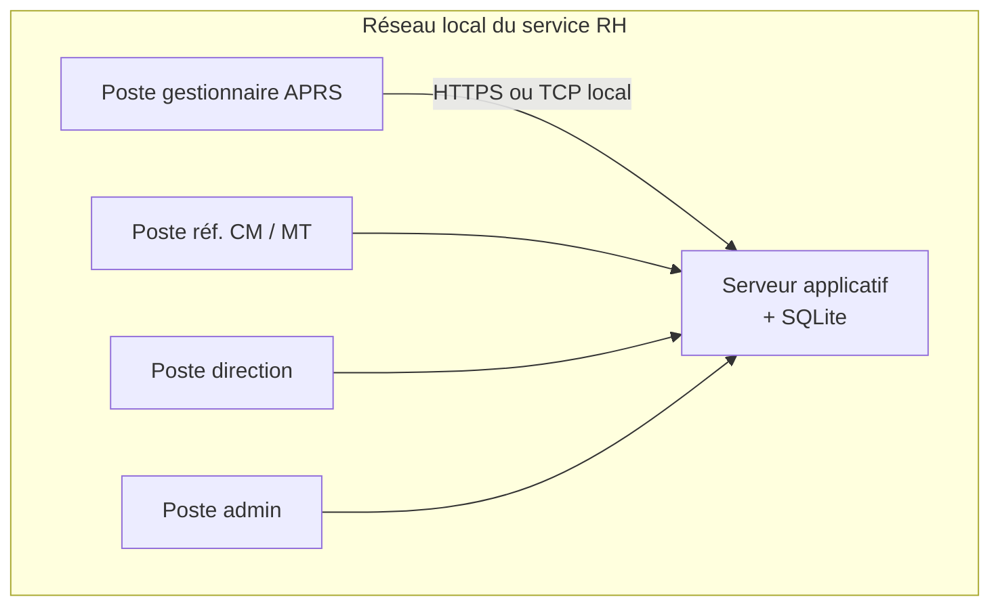
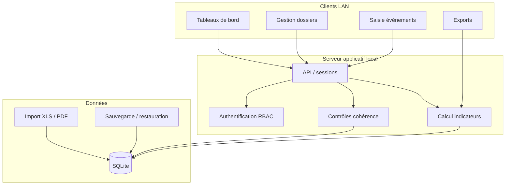

# Cahier des charges fonctionnel

## Application autonome de pilotage des absences pour raison de santé

**Projet :** Lulu Santé (nom de travail)  
**Version du document :** 1.1  
**Date :** 30 mai 2026  
**Dernière mise à jour :** réponses commanditaire intégrées (§3)
**Référence métier :** [README.md](./README.md) — catalogue des indicateurs

---

## 1. Objet du document

Ce cahier des charges fonctionnel (CDF) décrit une **application autonome**, installable localement (exécutable desktop), dotée d'une **base de données intégrée**, destinée à un service RH spécialisé dans le suivi des **absences pour raison de santé** (APRS ou équivalent en collectivité / établissement public).

L'application doit permettre :

1. **Saisir et structurer** les dossiers agents et les événements associés ;
2. **Calculer automatiquement** l'ensemble des indicateurs définis dans le README ;
3. **Restituer** ces indicateurs sous forme de tableaux de bord, rapports et exports ;
4. **Piloter** l'activité du service sur les 4 dimensions : volume, délais, prévention/retour à l'emploi, impact organisationnel.

Ce document est **fonctionnel** : il ne fige pas la stack technique, mais précise le périmètre, les utilisateurs, les données, les règles de calcul et les critères d'acceptation.

---

## 2. Contexte et enjeux

### 2.1 Contexte

Les services RH en charge des absences maladie, longue maladie, longue durée, CITIS, disponibilité d'office, conseil médical et médecine du travail doivent produire régulièrement des **indicateurs fiables** pour :

- le suivi opérationnel des dossiers ;
- le reporting interne (chef de service, direction RH) ;
- les comités de direction ;
- l'amélioration continue (délais, retour à l'emploi, reclassement).

Aujourd'hui, ces indicateurs sont souvent produits manuellement (tableurs, extractions SI RH hétérogènes), avec des **risques d'erreur**, de **double saisie** et de **manque d'historisation**.

### 2.2 Objectifs

| Objectif | Description |
|----------|-------------|
| **Centraliser** | Un référentiel unique des dossiers et événements liés à la santé au travail |
| **Automatiser** | Calcul des indicateurs sans retraitement manuel |
| **Tracer** | Historique des modifications et des snapshots de reporting |
| **Autonomiser** | Fonctionnement hors ligne, sans dépendance à un SI RH central |
| **Sécuriser** | Données de santé et RH hébergées localement, conformes RGPD |

### 2.3 Périmètre

#### Inclus (MVP puis extensions)

- Gestion des dossiers agents en absence pour raison de santé
- Saisie des événements : arrêts, démarches RH, conseil médical, médecine du travail, maintien en emploi, retraite, parcours PPR
- Calcul et affichage des **9 blocs d'indicateurs** du README (sections 1 à 9)
- Tableau de bord **APRS** (9 indicateurs stratégiques)
- Exports PDF et CSV/Excel
- Paramétrage : pôles, périodes, jours ouvrables de référence (20 j/mois), seuils KPI

#### Hors périmètre (v1)

- Connexion temps réel au SIRH / paie
- Reprise d'historique de dossiers existants (démarrage à blanc)
- Gestion de la paie et des indemnités
- Signature électronique des documents médicaux
- Portail agent self-service
- Application mobile native
- Hébergement cloud multi-collectivités (SaaS)

---

## 3. Décisions de cadrage validées

Les choix ci-dessous ont été **validés par le commanditaire** et s'imposent pour la suite du projet.

### 3.1 Réponses validées

| # | Sujet | Décision retenue |
|---|-------|------------------|
| D1 | **Volumes cibles** | ~**300 agents** suivis, ~**300 dossiers actifs** simultanés, historique depuis **2005** |
| D2 | **Données initiales** | **Démarrage à blanc** — pas de reprise d'historique de dossiers |
| D3 | **SI RH amont** | Exports **Excel (.xls/.xlsx)** et **PDF** issus du reporting RH (pas de connecteur temps réel) |
| D4 | **Dénominateur absentéisme** | **20 jours ouvrables** par agent et par mois (valeur de référence fixe, paramétrable) |
| D5 | **Reclassement réussi** (KPI §9) | L'**agent a trouvé un nouveau poste** — enregistré par une **date d'affectation** sur le parcours PPR |
| D6 | **Mode d'usage** | **Multi-utilisateur** sur **réseau local**, avec **droits différenciés** par profil (cf. §4.2) |

### 3.2 Volumes et capacité — estimation

| Élément | Valeur | Impact technique |
|---------|--------|------------------|
| Agents référencés | ~300 | Base agents légère |
| Dossiers actifs simultanés | ~300 | Charge courante modérée |
| Historique | Depuis 2005 (~21 ans) | Estimation **2 000 à 4 000 dossiers clôturés** cumulés |
| Épisodes d'absence | ~3 à 5 par dossier en moyenne | **6 000 à 15 000 épisodes** sur toute la durée de vie |
| Utilisateurs concurrents | 3 à 10 postes | Architecture client/serveur LAN requise |

### 3.3 Hypothèses techniques complémentaires (non encore tranchées)

| # | Sujet | Hypothèse proposée |
|---|-------|-------------------|
| H1 | Poste de travail | Windows 10/11 (64 bits) |
| H2 | Déploiement | Serveur applicatif sur un poste du service + clients LAN |
| H3 | Base de données | SQLite sur le serveur local (accès exclusivement via l'application, pas de partage direct du fichier) |
| H4 | Authentification | Comptes locaux applicatifs (login / mot de passe) |
| H5 | Référentiel absence | Types figés selon README (COM, CLM, CLD, etc.) |

### 3.4 Formule absentéisme (décision D4)

```
Taux d'absentéisme (période P) =
    SUM(jours d'absence sur P)
    ─────────────────────────────────────────────
    SUM(effectif agents du pôle × 20 × nb mois de P)
```

- **20** = nombre de jours ouvrables de référence par agent et par mois.
- L'effectif retenu est l'effectif du pôle concerné (ou global si pas de filtre).
- Paramètre admin `jours_ouvrables_mensuels` (défaut : 20), modifiable si la collectivité adopte une autre convention.

### 3.5 Reclassement réussi (décision D5)

Un reclassement est **réussi** lorsque :

1. Un parcours PPR est ouvert pour l'agent ; **et**
2. Une **date d'affectation** sur un nouveau poste est renseignée.

**KPI §9 — Taux de reclassement réussi :**

```
COUNT(parcours PPR avec date_affectation renseignée sur P)
────────────────────────────────────────────────────────── × 100
COUNT(parcours PPR entrés sur P)
```

Une reprise en modalité « reclassement » sans date d'affectation PPR ne suffit pas à elle seule à qualifier un reclassement réussi.

---

## 4. Utilisateurs et profils

### 4.1 Personas

| Persona | Besoin principal |
|---------|------------------|
| **Gestionnaire APRS** | Saisir les dossiers, mettre à jour les étapes, produire les tableaux mensuels |
| **Référent Conseil médical** | Saisir/consulter les saisines et avis |
| **Référent Médecine du travail** | Saisir aptitudes, inaptitudes, reclassements |
| **Chef de service RH** | Consulter les KPIs, comparer les pôles, préparer les comités |
| **Administrateur applicatif** | Gérer les utilisateurs, imports, paramètres, sauvegardes |

### 4.2 Matrice des droits (RBAC)

| Fonctionnalité | Gestionnaire | Réf. CM | Réf. MT | Direction | Admin |
|----------------|:------------:|:-------:|:-------:|:---------:|:-----:|
| Consulter tableaux de bord | ✓ | ✓ | ✓ | ✓ | ✓ |
| Créer / modifier dossier agent | ✓ | — | — | — | ✓ |
| Saisir événements conseil médical | ✓ | ✓ | — | — | ✓ |
| Saisir événements médecine travail | ✓ | — | ✓ | — | ✓ |
| Exporter rapports | ✓ | ✓ | ✓ | ✓ | ✓ |
| Paramétrage référentiels | — | — | — | — | ✓ |
| Import / sauvegarde base | — | — | — | — | ✓ |
| Gestion utilisateurs | — | — | — | — | ✓ |

> **Mode multi-utilisateur (D6) :** plusieurs postes du service accèdent simultanément à la même base via un **serveur applicatif** hébergé sur le réseau local (cf. §5.3). Les droits du tableau ci-dessus s'appliquent à chaque session connectée.

---

## 5. Architecture fonctionnelle de l'application

### 5.1 Principes

- **Réseau local :** déploiement **client/serveur** sur le LAN du service RH ; pas de dépendance Internet.
- **Base centralisée :** un seul poste serveur héberge la base SQLite ; les clients n'y accèdent que via l'application (jamais par partage réseau direct du fichier `.db`, incompatible multi-écriture).
- **Couches logiques :**
  - Client desktop ou navigateur (interface utilisateur)
  - Serveur applicatif local (API + moteur métier + gestion des accès concurrents)
  - Base de données SQLite (sur le serveur)
  - Module d'import/export

### 5.2 Schéma de déploiement (réseau local)



| Composant | Rôle |
|-----------|------|
| **Serveur applicatif** | Héberge la base, calcule les indicateurs, gère les sessions et verrouillages |
| **Client** | Interface de saisie et tableaux de bord ; installable ou accessible via navigateur local |
| **Sauvegarde** | Copie planifiée du fichier `.db` sur un autre poste ou NAS (lecture seule) |

### 5.3 Couches applicatives



### 5.4 Modules fonctionnels

| Module | Code | Description |
|--------|------|-------------|
| Référentiels | REF | Pôles, types d'absence, motifs retraite, types d'attente |
| Agents & dossiers | DOS | Fiche agent, dossier APRS, statut, chronologie |
| Absences & arrêts | ABS | Périodes d'absence, types, durées |
| Conseil médical | CM | Saisines, avis, délais d'instruction |
| Médecine du travail | MT | Aptitudes, inaptitudes, reclassements |
| Retour à l'emploi | RE | Reprises, rechutes, reprise durable |
| Maintien en emploi | ME | Études de poste, aménagements, orientations |
| Retraite | RET | Départs, motifs, dossiers en préparation |
| Parcours PPR | PPR | Entrées/sorties, durée de parcours |
| Indicateurs | IND | Moteur de calcul, tableaux de bord, KPI |
| Reporting | RPT | Exports PDF, Excel, snapshots |
| Administration | ADM | Utilisateurs, paramètres, sauvegarde, journal |

---

## 6. Modèle de données conceptuel

### 6.1 Entités principales

```
Agent ──< Dossier ──< EpisodeAbsence
                  ──< EvenementDossier
                  ──< Attente
                  ──< SaisineConseilMedical
                  ──< VisiteMedecineTravail
                  ──< RepriseEmploi
                  ──< ActionMaintienEmploi
                  ──< DepartRetraite
                  ──< ParcoursPPR

Pole ──< Agent
ReferentielTypeAbsence
ReferentielMotifRetraite
ParametreApplication (jours_ouvrables_mensuels = 20)
SnapshotIndicateur (historisation des reportings)
Utilisateur
SessionUtilisateur
JournalAudit
```

### 6.2 Entités détaillées (attributs essentiels)

#### Agent
| Attribut | Type | Obligatoire | Notes |
|----------|------|:-----------:|-------|
| id | CHAR(26) | ✓ | ULID — cf. [schema-base-donnees.md](./schema-base-donnees.md) |
| matricule | texte | ✓ | Unique |
| nom, prénom | texte | ✓ | |
| pole_id | CHAR(8) | ✓ | FK → ref_pole |
| statut_emploi | enum | ✓ | Titulaire, contractuel, etc. |
| actif | booléen | ✓ | Agent toujours en effectif |
| date_entree, date_sortie | date | | |

#### Dossier
| Attribut | Type | Obligatoire | Notes |
|----------|------|:-----------:|-------|
| id | CHAR(26) | ✓ | ULID |
| agent_id | CHAR(26) | ✓ | FK → agent |
| numero_dossier | texte | ✓ | Unique, lisible |
| statut | enum | ✓ | `actif`, `cloture` |
| type_absence_principal | enum | ✓ | COM, CLM, CLD, etc. |
| date_reception_arret | date | ✓ | Point de départ délai ouverture |
| date_creation_dossier | date | ✓ | |
| date_cloture | date | | |
| date_demarches_obligatoires | date | | Fin du délai de traitement |
| complet | booléen | ✓ | Pour taux dossiers à jour |
| commentaire | texte long | | |

#### EpisodeAbsence
| Attribut | Type | Obligatoire | Notes |
|----------|------|:-----------:|-------|
| dossier_id | référence | ✓ | |
| type_absence | enum | ✓ | COM, CLM, CLD, AS, MP, TPT, DO, CITIS |
| date_debut | date | ✓ | |
| date_fin | date | | Null si en cours |
| jours_ouvrables | entier | | Calculé ou importé |

#### Attente
| Attribut | Type | Obligatoire | Notes |
|----------|------|:-----------:|-------|
| dossier_id | référence | ✓ | |
| type | enum | ✓ | Expertise, CM, décision admin, médecin agréé |
| date_debut | date | ✓ | |
| date_fin | date | | Null si en cours |

#### SaisineConseilMedical
| Attribut | Type | Obligatoire | Notes |
|----------|------|:-----------:|-------|
| dossier_id | référence | ✓ | |
| date_saisine | date | ✓ | |
| date_avis | date | | |
| resultat | enum | | Favorable, défavorable, sursis |

#### VisiteMedecineTravail
| Attribut | Type | Obligatoire | Notes |
|----------|------|:-----------:|-------|
| dossier_id | référence | ✓ | |
| date_visite | date | ✓ | |
| type_avis | enum | ✓ | Aptitude, inaptitude_poste, inaptitude_metier, reclassement |
| date_reclassement | date | | Si applicable |

#### RepriseEmploi
| Attribut | Type | Obligatoire | Notes |
|----------|------|:-----------:|-------|
| dossier_id | référence | ✓ | |
| date_reprise | date | ✓ | |
| modalite | enum | ✓ | Temps plein, TPT, reclassement |
| rechute | booléen | | Nouvel arrêt < 6 mois |

#### DepartRetraite
| Attribut | Type | Obligatoire | Notes |
|----------|------|:-----------:|-------|
| dossier_id | référence | ✓ | |
| motif | enum | ✓ | Inaptitude, handicap, droit, autre |
| date_decision | date | ✓ | |
| date_depart_effectif | date | | |
| en_preparation | booléen | ✓ | Dossier admin en cours |

#### ParcoursPPR
| Attribut | Type | Obligatoire | Notes |
|----------|------|:-----------:|-------|
| dossier_id | référence | ✓ | |
| date_entree | date | ✓ | |
| date_sortie | date | | |
| date_affectation | date | | **Obligatoire pour reclassement réussi (D5)** |
| poste_affectation | texte | | Libellé du nouveau poste |

#### ParametreApplication
| Attribut | Type | Obligatoire | Notes |
|----------|------|:-----------:|-------|
| jours_ouvrables_mensuels | entier | ✓ | Défaut : **20** (décision D4) |
| seuil_attente_jours | entier | ✓ | Défaut : 30 |
| duree_rechute_mois | entier | ✓ | Défaut : 6 |

> **Convention identifiants :** toutes les PK/FK sont des `CHAR(n)` à longueur fixe (pas d'entier auto-incrémenté, pas de UUID natif). Détail complet : [schema-base-donnees.md](./schema-base-donnees.md) et [schema.sql](./schema.sql).

---

## 7. Fonctionnalités détaillées

### 7.1 Module Référentiels (REF)

| ID | Fonctionnalité | Description | Priorité |
|----|----------------|-------------|:--------:|
| REF-01 | Gérer les pôles | CRUD pôles / directions (code, libellé, actif) | Must |
| REF-02 | Types d'absence | Liste figée ou paramétrable : COM, CLM, CLD, AS, MP, TPT, DO, CITIS | Must |
| REF-03 | Motifs retraite | Inaptitude, handicap, droit, autre | Must |
| REF-04 | Types d'attente | Expertise, CM, décision admin, médecin agréé | Must |
| REF-05 | Types orientation | MT, ergonomie, psy, FIPHFP, formation, bilan compétences | Must |
| REF-06 | Paramètres globaux | Seuil alerte dossiers en attente (30 j), durée rechute (6 mois) | Should |

### 7.2 Module Agents & dossiers (DOS)

| ID | Fonctionnalité | Description | Priorité |
|----|----------------|-------------|:--------:|
| DOS-01 | Fiche agent | Création, modification, recherche (matricule, nom, pôle) | Must |
| DOS-02 | Créer un dossier | À partir d'un agent, avec type d'absence et dates clés | Must |
| DOS-03 | Statut dossier | Actif / clôturé avec date et motif de clôture | Must |
| DOS-04 | Vue chronologique | Timeline de tous les événements d'un dossier | Must |
| DOS-05 | Indicateurs dossier | Résumé : durée absence, délais, prochaine échéance | Should |
| DOS-06 | Pièces jointes | Joindre un document (arrêt scanné, avis) — stockage local chiffré | Could |
| DOS-07 | Import agents | Import Excel (.xls/.xlsx) depuis export reporting RH | Must |
| DOS-08 | Contrôles | Alerte si chevauchement d'épisodes incohérent, dates inversées | Must |

### 7.3 Module Absences (ABS)

| ID | Fonctionnalité | Description | Priorité |
|----|----------------|-------------|:--------:|
| ABS-01 | Saisir un épisode | Type, dates début/fin, lien dossier | Must |
| ABS-02 | Calcul jours | Calcul automatique jours ouvrables (paramètre calendrier) | Must |
| ABS-03 | Absence en cours | Dossiers sans date de fin — comptabilisés dans le stock actif | Must |
| ABS-04 | Historique multi-épisodes | Un dossier peut avoir plusieurs épisodes (prolongations, rechutes) | Must |

### 7.4 Module Conseil médical (CM)

| ID | Fonctionnalité | Description | Priorité |
|----|----------------|-------------|:--------:|
| CM-01 | Enregistrer une saisine | Date saisine, dossier lié | Must |
| CM-02 | Enregistrer l'avis | Date avis + résultat (favorable / défavorable / sursis) | Must |
| CM-03 | Délai instruction | Calcul auto : date_avis − date_saisine | Must |
| CM-04 | Attente CM | Lien possible avec entité Attente | Should |

### 7.5 Module Médecine du travail (MT)

| ID | Fonctionnalité | Description | Priorité |
|----|----------------|-------------|:--------:|
| MT-01 | Visite aptitude | Comptabiliser un avis d'aptitude | Must |
| MT-02 | Visite inaptitude | Sous-type : au poste / au métier | Must |
| MT-03 | Reclassement MT | Enregistrer une proposition ou un reclassement | Must |
| MT-04 | Lien inaptitude → PPR | Déclenchement alerte parcours reclassement | Should |

### 7.6 Module Retour à l'emploi (RE)

| ID | Fonctionnalité | Description | Priorité |
|----|----------------|-------------|:--------:|
| RE-01 | Enregistrer une reprise | Date + modalité (TP, TPT, reclassement) | Must |
| RE-02 | Détecter rechute | Nouvel épisode d'absence < 6 mois après reprise | Must |
| RE-03 | Reprise durable | Vérification automatique à J+90, J+180, J+365 | Must |

### 7.7 Module Maintien en emploi (ME)

| ID | Fonctionnalité | Description | Priorité |
|----|----------------|-------------|:--------:|
| ME-01 | Étude de poste | Date, dossier, statut | Must |
| ME-02 | Aménagement de poste | Date, description | Must |
| ME-03 | Orientation | Type (MT, ergonomie, psy, FIPHFP, formation, bilan) | Must |

### 7.8 Module Retraite (RET)

| ID | Fonctionnalité | Description | Priorité |
|----|----------------|-------------|:--------:|
| RET-01 | Dossier retraite | Motif, dates décision et départ | Must |
| RET-02 | En préparation | Flag dossier administratif non finalisé | Must |
| RET-03 | Délai traitement | date_depart − date_decision | Must |

### 7.9 Module Parcours PPR (PPR)

| ID | Fonctionnalité | Description | Priorité |
|----|----------------|-------------|:--------:|
| PPR-01 | Ouvrir un parcours | Date d'entrée, lien dossier inaptitude | Must |
| PPR-02 | Clôturer un parcours | Date sortie ou date affectation | Must |
| PPR-03 | Stock parcours | Parcours ouverts à une date donnée | Must |
| PPR-04 | Durée parcours | date_affectation − date_entree | Must |
| PPR-05 | Reclassement réussi | Flag auto si `date_affectation` renseignée (D5) | Must |

### 7.10 Module Indicateurs (IND)

| ID | Fonctionnalité | Description | Priorité |
|----|----------------|-------------|:--------:|
| IND-01 | Tableau de bord global | Navigation par les 9 sections du README | Must |
| IND-02 | Filtres | Période (mois, trimestre, année, plage libre), pôle, type absence | Must |
| IND-03 | KPI direction | Vue §9 avec code couleur objectif (↑/↓) | Must |
| IND-04 | Dashboard APRS | 9 indicateurs stratégiques sur une page | Must |
| IND-05 | Drill-down | Clic sur un indicateur → liste des dossiers/agents concernés | Should |
| IND-06 | Comparaison N/N-1 | Variation vs période précédente | Should |
| IND-07 | Snapshot | Enregistrer une photo des indicateurs à une date (reporting figé) | Should |
| IND-08 | Alertes | Dossiers en attente > 30 j, absences > 180 j | Should |

### 7.11 Module Reporting (RPT)

| ID | Fonctionnalité | Description | Priorité |
|----|----------------|-------------|:--------:|
| RPT-01 | Export PDF | Rapport complet ou par section (comme le PDF indicateurs) | Must |
| RPT-02 | Export Excel/CSV | Données brutes + indicateurs calculés | Must |
| RPT-03 | Export liste dossiers | Extraction filtrée pour analyse externe | Must |
| RPT-04 | Modèle de rapport | En-tête collectivité, période, logo | Should |

### 7.12 Module Administration (ADM)

| ID | Fonctionnalité | Description | Priorité |
|----|----------------|-------------|:--------:|
| ADM-01 | Comptes utilisateurs | CRUD, rôles, mot de passe | Must |
| ADM-02 | Sauvegarde | Export fichier `.db` ou archive chiffrée | Must |
| ADM-03 | Restauration | Import sauvegarde avec confirmation | Must |
| ADM-04 | Journal d'audit | Qui a modifié quoi et quand | Must |
| ADM-05 | Paramètres globaux | Jours ouvrables mensuels (défaut 20), seuils KPI | Must |
| ADM-06 | Déploiement serveur | Installation / démarrage du service applicatif LAN | Must |

---

## 8. Règles de calcul des indicateurs

Chaque indicateur est calculé à partir des entités décrites en §6. Les formules reprennent le README et les décisions validées en §3.

### 8.1 Section 1 — Activité

| Indicateur | Règle de calcul |
|------------|-----------------|
| Dossiers actifs | `COUNT(dossier)` WHERE statut = actif à la date de référence |
| Nouveaux dossiers du mois | `COUNT` WHERE date_creation_dossier ∈ période |
| Dossiers clôturés | `COUNT` WHERE date_cloture ∈ période |
| Répartition par type d'absence | `GROUP BY type_absence_principal` sur dossiers actifs |
| Répartition par pôle | `GROUP BY pole_id` sur dossiers actifs |

### 8.2 Section 2 — Absentéisme

| Indicateur | Règle de calcul |
|------------|-----------------|
| Taux d'absentéisme global | `SUM(jours_absence) / SUM(effectif × 20 × nb_mois)` × 100 — cf. §3.4 |
| Jours d'absence (M/T/A) | Somme des jours ouvrables des épisodes sur la période |
| Durée moyenne des arrêts | `AVG(duree_episode)` + répartition par tranches (<30, 30-90, 90-180, >180) |
| Agents absents > X | Agents distincts avec épisode en cours dont durée ≥ X mois |

### 8.3 Section 3 — Gestion RH

| Indicateur | Règle de calcul |
|------------|-----------------|
| Délai moyen ouverture | `AVG(date_creation_dossier − date_reception_arret)` |
| Délai moyen traitement | `AVG(date_demarches_obligatoires − date_reception_arret)` |
| Taux dossiers à jour | `COUNT(complet=true) / COUNT(dossiers actifs)` × 100 |
| Dossiers en attente | `COUNT(attente)` WHERE date_fin IS NULL, par type |

### 8.4 Section 4a — Conseil médical

| Indicateur | Règle de calcul |
|------------|-----------------|
| Nombre de saisines | `COUNT(saisine)` WHERE date_saisine ∈ période |
| Délai moyen instruction | `AVG(date_avis − date_saisine)` |
| Avis favorables / défavorables / sursis | `COUNT` par resultat et par période |

### 8.5 Section 4b — Médecine du travail

| Indicateur | Règle de calcul |
|------------|-----------------|
| Nombre d'aptitude | `COUNT(visite)` WHERE type = aptitude |
| Nombre d'inaptitude | `COUNT(visite)` WHERE type IN (inaptitude_poste, inaptitude_metier) |
| — au poste / au métier | Sous-comptage par sous-type |
| Nombre de reclassement | `COUNT(visite)` WHERE type = reclassement |

### 8.6 Section 5 — Retour à l'emploi

| Indicateur | Règle de calcul |
|------------|-----------------|
| Taux retour à l'emploi | `COUNT(reprises) / COUNT(dossiers suivis)` × 100 |
| Reprise durable 3/6/12 mois | Reprises sans rechute ni nouvel arrêt à J+90, J+180, J+365 |
| Reprises par modalité | `GROUP BY modalite` |
| Taux rechute | `COUNT(rechute) / COUNT(reprises)` × 100 |

### 8.7 Section 6 — Maintien en emploi

| Indicateur | Règle de calcul |
|------------|-----------------|
| Études de poste | `COUNT(action)` WHERE type = etude_poste |
| Aménagements | `COUNT(action)` WHERE type = amenagement |
| Reclassements | `COUNT(action)` WHERE type = reclassement |
| Orientations | `COUNT` par type d'orientation |

### 8.8 Section 7 — Retraite

| Indicateur | Règle de calcul |
|------------|-----------------|
| Départs à la retraite | `COUNT(depart)` WHERE date_depart ∈ période |
| Répartition par motif | `GROUP BY motif` |
| Délai moyen traitement | `AVG(date_depart − date_decision)` |
| Dossiers en préparation | `COUNT` WHERE en_preparation = true |
| Taux départ retraite | `COUNT(departs) / COUNT(dossiers longue durée suivis)` × 100 |

### 8.9 Section 8 — PPR

| Indicateur | Règle de calcul |
|------------|-----------------|
| Entrées / sorties / total | Parcours avec date_entree ou date_sortie ∈ période ; stock = ouverts |
| Taux entrée parcours | `COUNT(entrees PPR) / COUNT(inaptitudes MT)` × 100 |
| Durée moyenne parcours | `AVG(date_affectation − date_entree)` |

### 8.10 Section 9 — KPIs direction

| KPI | Règle | Objectif |
|-----|-------|:--------:|
| Taux absentéisme global | Cf. §8.2 | ↓ |
| Agents en arrêt > 180 j | Cf. §8.2 | ↓ |
| Délai traitement dossiers | Cf. §8.3 | ↓ |
| Taux retour emploi | Cf. §8.6 | ↑ |
| Reprise durable 12 mois | Cf. §8.6 | ↑ |
| Taux reclassement réussi | `COUNT(PPR avec date_affectation)` / `COUNT(entrees PPR)` — cf. §3.5 | ↑ |
| Dossiers en attente > 30 j | Attentes ouvertes depuis > 30 jours | ↓ |

---

## 9. Parcours utilisateur types

### 9.1 Création d'un dossier (gestionnaire APRS)

1. Rechercher ou importer l'agent
2. Créer un dossier : saisir date réception arrêt, type d'absence, pôle
3. Saisir le premier épisode d'absence
4. Enregistrer la date de création du dossier (auto ou manuelle)
5. Le dossier apparaît dans « dossiers actifs » et alimente les indicateurs §1

### 9.2 Production du tableau de bord mensuel

1. Sélectionner la période (ex. mai 2026)
2. Filtrer éventuellement par pôle
3. Consulter le dashboard APRS (9 indicateurs)
4. Naviguer vers le détail d'une section (ex. conseil médical)
5. Exporter en PDF pour le comité de direction
6. Optionnel : enregistrer un snapshot

### 9.3 Clôture d'un parcours complet

1. Enregistrer avis MT (inaptitude au métier)
2. Ouvrir parcours PPR
3. Saisir actions maintien emploi (orientations, aménagements)
4. Enregistrer reprise (reclassement) ou départ retraite
5. Clôturer le dossier APRS
6. Les indicateurs §5, §6, §7, §8 se mettent à jour

---

## 10. Exigences non fonctionnelles

| Domaine | Exigence |
|---------|----------|
| **Performance** | Tableau de bord < 3 s avec ~300 dossiers actifs et ~4 000 dossiers historiques |
| **Concurrence** | 10 utilisateurs simultanés sans corruption de données (verrouillage optimiste) |
| **Disponibilité** | Fonctionnement sur réseau local sans Internet ; clients dégradés si serveur arrêté |
| **Sauvegarde** | Rappel mensuel de sauvegarde ; procédure de restauration documentée |
| **Sécurité** | Chiffrement au repos (SQLCipher ou équivalent) ; mots de passe hashés (bcrypt/Argon2) |
| **RGPD** | Minimisation des données ; registre des traitements ; durée de conservation paramétrable ; droit d'accès via export |
| **Audit** | Journal des créations/modifications/suppressions sur dossiers et avis médicaux |
| **Portabilité** | Base SQLite copiable ; export complet des données |
| **Ergonomie** | Interface en français ; navigation clavier ; contrastes accessibles (RGAA niveau AA visé) |
| **Installation** | Sans droits administrateur si possible ; taille installée < 200 Mo |
| **Compatibilité** | Windows 10/11 64 bits ; réseau local Ethernet/Wi-Fi du service |

---

## 11. Interfaces et écrans (inventaire)

| Écran | Contenu principal |
|-------|-------------------|
| Accueil / Dashboard APRS | 9 KPI stratégiques, alertes, accès rapide |
| Liste dossiers | Filtres, statut, type absence, pôle, durée |
| Fiche dossier | Agent, chronologie, onglets événements |
| Saisie arrêt | Formulaire épisode absence |
| Conseil médical | Liste saisines, formulaire avis |
| Médecine du travail | Liste visites, formulaire aptitude/inaptitude |
| Retour emploi | Reprises, indicateur rechute |
| Maintien emploi | Actions et orientations |
| Retraite | Départs, dossiers en préparation |
| Parcours PPR | Entrées, sorties, durées |
| Indicateurs détaillés | 9 sections avec graphiques et tableaux |
| KPI direction | Tableau §9 avec tendances |
| Exports | Choix format, période, sections |
| Administration | Utilisateurs, imports, sauvegardes, paramètres |
| Import | Assistant mapping colonnes CSV |

---

## 12. Imports et intégrations

> **Démarrage à blanc (D2) :** aucune reprise d'historique de dossiers en v1. Seul le référentiel agents peut être pré-alimenté par import.

### 12.1 Import agents depuis le reporting RH (Excel)

Source : exports **.xls / .xlsx** produits par le SI RH (reporting).

Colonnes minimales : `matricule`, `nom`, `prenom`, `pole`, `statut_emploi`

Comportement :
- Création si matricule inconnu
- Mise à jour si matricule existant (sans écraser l'historique dossiers)
- Rapport d'import (créés, mis à jour, erreurs)
- Assistant de mapping des colonnes (les libellés varient selon l'export)

### 12.2 Import documentaire PDF (optionnel)

Import de PDF de reporting RH **à titre de référence archivée** (lecture seule, non structuré pour le calcul des indicateurs). Ne remplace pas la saisie des dossiers.

### 12.3 Exports

| Format | Usage |
|--------|-------|
| PDF | Comité direction, archivage |
| Excel/CSV | Analyse complémentaire |
| JSON | Interopérabilité future |

---

## 13. Phasage proposé

### Phase 0 — Cadrage (2 à 3 semaines)

- ~~Validation des hypothèses §3~~ ✓ **Décisions D1–D6 validées**
- Atelier maquettes (dashboard, fiche dossier, déploiement serveur LAN)
- Jeu de recette §15 (10 dossiers types)

### Phase 1 — MVP (3 à 4 mois)

- Architecture client/serveur LAN + authentification RBAC
- Référentiels, agents, dossiers, épisodes d'absence
- Conseil médical + médecine du travail
- Indicateurs §1, §2, §3, §4a, §4b (formule absentéisme 20 j)
- Dashboard APRS + export PDF
- Import agents Excel, sauvegarde serveur

### Phase 2 — Parcours complets (2 mois)

- Retour emploi, maintien, retraite, PPR (avec date d'affectation / reclassement réussi D5)
- Indicateurs §5 à §9 + KPI direction
- Drill-down, snapshots, alertes

### Phase 3 — Industrialisation (1 à 2 mois)

- Pièces jointes, durcissement sécurité, documentation, formation
- Installeur serveur + clients, procédure de déploiement LAN
- Tests de charge 10 utilisateurs concurrents

---

## 14. Critères d'acceptation globaux

| # | Critère | Méthode de vérification |
|---|---------|-------------------------|
| CA-01 | Tous les indicateurs du README sont calculés et affichés | Jeu de tests avec dossiers de référence |
| CA-02 | Les 9 KPI APRS correspondent aux valeurs calculées manuellement sur le jeu de test | Recette métier |
| CA-03 | L'application fonctionne sans connexion Internet (réseau local suffisant) | Test LAN isolé |
| CA-04 | La base est sauvegardable et restaurable sans perte | Test backup/restore |
| CA-05 | Un import de 300 agents Excel se termine en < 1 minute avec rapport | Test de charge |
| CA-06 | Seul un admin peut restaurer une sauvegarde ou gérer les utilisateurs | Test RBAC |
| CA-07 | L'export PDF reprend les 9 sections sur la période sélectionnée | Comparaison visuelle |
| CA-08 | Toute modification de dossier est tracée dans le journal d'audit | Test fonctionnel |
| CA-09 | 10 utilisateurs simultanés peuvent saisir sans conflit ni perte de données | Test concurrence |
| CA-10 | Le KPI « reclassement réussi » n'est vrai que si date d'affectation PPR renseignée | Recette métier D5 |

---

## 15. Jeu de données de recette (exemple)

Pour valider les indicateurs, un jeu minimal de **10 dossiers** couvrant :

| Cas | Attendu indicatif |
|-----|-------------------|
| 2 dossiers COM < 30 j | Tranche courte §2 |
| 1 CLM > 180 j actif | KPI agents > 180 j |
| 1 CLD avec saisine CM favorable | §4a |
| 1 inaptitude poste + parcours PPR | §4b + §8 |
| 1 reprise TP sans rechute à 6 mois | §5 reprise durable |
| 1 reprise avec rechute à 3 mois | §5 taux rechute |
| 1 retraite inaptitude en préparation | §7 |
| 1 dossier en attente CM > 30 j | KPI §9 |
| 2 pôles différents | Répartition §1 |

---

## 16. Glossaire

| Terme | Définition |
|-------|------------|
| **APRS** | Absences pour raison de santé — cellule RH spécialisée |
| **COM** | Congé maladie ordinaire |
| **CLM** | Congé longue maladie |
| **CLD** | Congé longue durée |
| **CITIS** | Congé pour Invalidité Temporaire Imputable au Service |
| **TPT** | Temps partiel thérapeutique |
| **DO** | Disponibilité d'office pour raison de santé |
| **PPR** | Parcours de reclassement (formation) |
| **CM** | Conseil médical |
| **MT** | Médecine du travail |
| **KPI** | Key Performance Indicator — indicateur de pilotage |

---

## 17. Annexes

- **Annexe A :** [README.md](./README.md) — catalogue des indicateurs
- **Annexe B :** [Indicateurs-RH-Absences-Sante.pdf](./Indicateurs-RH-Absences-Sante.pdf) — restitution PDF de référence
- **Annexe C :** [maquettes-ecrans.md](./maquettes-ecrans.md) + [Canvas interactif](/C:/Users/xsima/.cursor/projects/c-Users-xsima-Desktop-lulu-sante/canvases/lulu-sante-maquettes.canvas.tsx)
- **Annexe D :** [schema-base-donnees.md](./schema-base-donnees.md) + [schema.sql](./schema.sql) — schéma SQLite (PK/FK en `CHAR`)

---

*Document v1.1 — Décisions D1 à D6 validées. Prochaine étape recommandée : maquettes écrans + schéma de base de données.*
