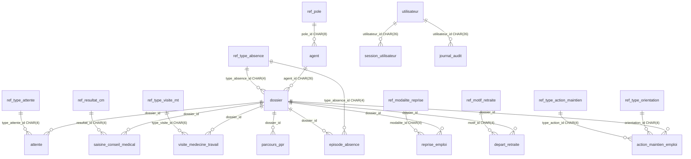

# Schéma de base de données — Lulu Santé

**Version :** 1.0  
**SGBD :** SQLite 3 (serveur applicatif LAN)  
**Référence :** [cahier-des-charges-fonctionnel.md](./cahier-des-charges-fonctionnel.md) §6

---

## 1. Règle d'or — identifiants `CHAR`

**Tous les identifiants primaires et étrangers sont des `CHAR(n)` à longueur fixe.**  
Aucun entier auto-incrémenté, aucun type UUID natif.

| Objectif | Moyen |
|----------|--------|
| Intégrité référentielle | Longueur fixe + `CHECK (length(col) = n)` |
| Lisibilité en debug | Préfixes optionnels par table (voir §2) |
| Unicité | ULID 26 caractères pour les entités transactionnelles |
| Stabilité des référentiels | Codes métier `CHAR(4)`…`CHAR(8)` immuables |

> SQLite stocke `CHAR(n)` en affinity TEXT ; la contrainte `CHECK` garantit la longueur en application.

### DDL type

```sql
id CHAR(26) NOT NULL PRIMARY KEY
    CHECK (length(id) = 26 AND id GLOB '[0-9A-HJKMNP-TV-Z]*'),

agent_id CHAR(26) NOT NULL
    REFERENCES agent (id) ON DELETE RESTRICT
    CHECK (length(agent_id) = 26),
```

---

## 2. Conventions de génération des ID

| Catégorie | Type SQL | Longueur | Format | Exemple |
|-----------|----------|:--------:|--------|---------|
| Entités transactionnelles | `CHAR(26)` | 26 | ULID (Crockford Base32) | `01J8K3M4N5P6Q7R8S9T0UVWX` |
| Pôles | `CHAR(8)` | 8 | `P` + 7 alphanum. | `P0000001` |
| Codes référentiels | `CHAR(4)` | 4 | Code métier uppercase | `COM`, `CLM`, `EXPM` |
| Codes référentiels longs | `CHAR(6)` | 6 | Code métier | `INAP_M`, `INAP_P` |
| Paramètre singleton | `CHAR(4)` | 4 | Constante | `CONF` |

### Préfixes ULID recommandés (optionnel, 2 premiers caractères réservés)

L'application peut préfixer les ULID pour faciliter la lecture ; la longueur reste **26** :

| Préfixe logique | Table |
|-----------------|-------|
| (ULID pur) | agent, dossier, episode_absence, … |

La génération est **centralisée côté serveur** ; jamais côté client sans validation.

---

## 3. Diagramme relationnel



---

## 4. Tables référentielles

Clés primaires = **codes métier** (`CHAR`), pas de surrogate key.

### 4.1 `ref_type_absence` — PK `CHAR(4)`

| code | libelle |
|------|---------|
| `COMO` | Maladie ordinaire (COM) |
| `CLML` | Longue maladie (CLM) |
| `CLDL` | Longue durée (CLD) |
| `ACCS` | Accident de service |
| `MALP` | Maladie professionnelle |
| `TPTE` | Temps partiel thérapeutique (TPT) |
| `DOFF` | Disponibilité d'office |
| `CITI` | CITIS |

### 4.2 `ref_type_attente` — PK `CHAR(4)`

| code | libelle |
|------|---------|
| `EXPM` | Expertise médicale |
| `CMED` | Avis du conseil médical |
| `DADM` | Décision administrative |
| `MAGR` | Retour médecin agréé |

### 4.3 `ref_resultat_cm` — PK `CHAR(4)`

| code | libelle |
|------|---------|
| `FAVR` | Avis favorable |
| `DEFA` | Avis défavorable |
| `SURS` | Sursis à statuer |

### 4.4 `ref_type_visite_mt` — PK `CHAR(6)`

| code | libelle |
|------|---------|
| `APTITU` | Aptitude |
| `INAPOP` | Inaptitude au poste |
| `INAPMT` | Inaptitude au métier |
| `RECLMT` | Reclassement |

### 4.5 `ref_modalite_reprise` — PK `CHAR(4)`

| code | libelle |
|------|---------|
| `TPLE` | Temps plein |
| `TPTE` | Temps partiel thérapeutique |
| `RECL` | Reclassement |

### 4.6 `ref_motif_retraite` — PK `CHAR(4)`

| code | libelle |
|------|---------|
| `INAP` | Retraite pour inaptitude |
| `HAND` | Retraite anticipée handicap |
| `DRTE` | Retraite de droit (âge limite) |
| `AUTR` | Autres motifs liés à la santé |

### 4.7 `ref_type_orientation` — PK `CHAR(4)`

| code | libelle |
|------|---------|
| `MEDT` | Médecine du travail |
| `ERGO` | Ergonomie |
| `PSYC` | Accompagnement psychologique |
| `FIPH` | Handicap / FIPHFP |
| `FORM` | Formation |
| `BILA` | Bilan de compétences |

### 4.8 `ref_type_action_maintien` — PK `CHAR(4)`

| code | libelle |
|------|---------|
| `ETUD` | Étude de poste |
| `AMEN` | Aménagement de poste |
| `RECL` | Reclassement |

### 4.9 `ref_statut_emploi` — PK `CHAR(4)`

| code | libelle |
|------|---------|
| `TITU` | Titulaire |
| `CONT` | Contractuel |
| `STAG` | Stagiaire |
| `AUTR` | Autre |

### 4.10 `ref_statut_dossier` — PK `CHAR(4)`

| code | libelle |
|------|---------|
| `ACTI` | Actif |
| `CLOT` | Clôturé |

### 4.11 `ref_role_utilisateur` — PK `CHAR(4)`

| code | libelle |
|------|---------|
| `ADMN` | Administrateur |
| `GEST` | Gestionnaire APRS |
| `RCME` | Référent conseil médical |
| `RMED` | Référent médecine du travail |
| `DIRE` | Direction (lecture seule) |

### 4.12 Correspondance codes README ↔ base

Les libellés affichés à l'utilisateur reprennent le README ; les clés en base respectent `CHAR(4)` / `CHAR(6)`.

| Affichage (README) | PK base |
|--------------------|---------|
| COM | `COMO` |
| CLM | `CLML` |
| CLD | `CLDL` |
| CITIS | `CITI` |
| Conseil médical (attente) | `CMED` |
| Favorable / Défavorable / Sursis | `FAVR` / `DEFA` / `SURS` |

---

## 5. Tables transactionnelles

Toutes les PK/FK : **`CHAR(26)`** sauf références vers référentiels (`CHAR(4)` / `CHAR(6)` / `CHAR(8)`).

### 5.1 `ref_pole`

| Colonne | Type | Contraintes |
|---------|------|-------------|
| `id` | `CHAR(8)` | PK, `CHECK(length(id)=8)` |
| `code` | `TEXT` | UNIQUE, NOT NULL |
| `libelle` | `TEXT` | NOT NULL |
| `actif` | `INTEGER` | NOT NULL DEFAULT 1, CHECK(actif IN (0,1)) |
| `created_at` | `TEXT` | NOT NULL |
| `updated_at` | `TEXT` | NOT NULL |

**Jeu initial CHUM (Martinique)** — pôles cliniques et médico-techniques :

| `id` | `code` | `libelle` |
|------|--------|-----------|
| `CHUMBIOL` | BIOL | Biologie — Pathologie |
| `CHUMFMET` | FMET | Femme — Mère — Enfant de territoire |
| `CHUMGERI` | GERI | Gériatrie — Gérontologie |
| `CHUMIMGM` | IMGM | Imagerie médicale |
| `CHUMNEUR` | NEUR | Neurosciences — Appareil locomoteur |
| `CHUMPDIG` | PDIG | Pathologies digestives |
| `CHUMPALL` | PALL | Soins palliatifs |
| `CHUMURGE` | URGE | Médecine d'urgence |

### 5.2 `agent`

| Colonne | Type | Contraintes |
|---------|------|-------------|
| `id` | `CHAR(26)` | PK |
| `matricule` | `TEXT` | UNIQUE, NOT NULL |
| `nom` | `TEXT` | NOT NULL |
| `prenom` | `TEXT` | NOT NULL |
| `pole_id` | `CHAR(8)` | FK → ref_pole |
| `statut_emploi_id` | `CHAR(4)` | FK → ref_statut_emploi |
| `actif` | `INTEGER` | NOT NULL DEFAULT 1 |
| `date_entree` | `TEXT` | DATE ISO8601 |
| `date_sortie` | `TEXT` | DATE |
| `created_at` | `TEXT` | NOT NULL |
| `updated_at` | `TEXT` | NOT NULL |

### 5.3 `dossier`

| Colonne | Type | Contraintes |
|---------|------|-------------|
| `id` | `CHAR(26)` | PK |
| `agent_id` | `CHAR(26)` | FK → agent |
| `numero_dossier` | `TEXT` | UNIQUE, NOT NULL |
| `statut_id` | `CHAR(4)` | FK → ref_statut_dossier |
| `type_absence_id` | `CHAR(4)` | FK → ref_type_absence |
| `date_reception_arret` | `TEXT` | NOT NULL |
| `date_creation_dossier` | `TEXT` | NOT NULL |
| `date_cloture` | `TEXT` | |
| `date_demarches_obligatoires` | `TEXT` | |
| `complet` | `INTEGER` | NOT NULL DEFAULT 0 |
| `commentaire` | `TEXT` | |
| `created_at` | `TEXT` | NOT NULL |
| `updated_at` | `TEXT` | NOT NULL |

### 5.4 `episode_absence`

| Colonne | Type | Contraintes |
|---------|------|-------------|
| `id` | `CHAR(26)` | PK |
| `dossier_id` | `CHAR(26)` | FK → dossier |
| `type_absence_id` | `CHAR(4)` | FK → ref_type_absence |
| `date_debut` | `TEXT` | NOT NULL |
| `date_fin` | `TEXT` | NULL = en cours |
| `jours_ouvrables` | `INTEGER` | ≥ 0 |
| `created_at` | `TEXT` | NOT NULL |
| `updated_at` | `TEXT` | NOT NULL |

### 5.5 `attente`

| Colonne | Type | Contraintes |
|---------|------|-------------|
| `id` | `CHAR(26)` | PK |
| `dossier_id` | `CHAR(26)` | FK → dossier |
| `type_attente_id` | `CHAR(4)` | FK → ref_type_attente |
| `date_debut` | `TEXT` | NOT NULL |
| `date_fin` | `TEXT` | |
| `created_at` | `TEXT` | NOT NULL |
| `updated_at` | `TEXT` | NOT NULL |

### 5.6 `saisine_conseil_medical`

| Colonne | Type | Contraintes |
|---------|------|-------------|
| `id` | `CHAR(26)` | PK |
| `dossier_id` | `CHAR(26)` | FK → dossier |
| `date_saisine` | `TEXT` | NOT NULL |
| `date_avis` | `TEXT` | |
| `resultat_id` | `CHAR(4)` | FK → ref_resultat_cm |
| `created_at` | `TEXT` | NOT NULL |
| `updated_at` | `TEXT` | NOT NULL |

### 5.7 `visite_medecine_travail`

| Colonne | Type | Contraintes |
|---------|------|-------------|
| `id` | `CHAR(26)` | PK |
| `dossier_id` | `CHAR(26)` | FK → dossier |
| `date_visite` | `TEXT` | NOT NULL |
| `type_visite_id` | `CHAR(6)` | FK → ref_type_visite_mt |
| `created_at` | `TEXT` | NOT NULL |
| `updated_at` | `TEXT` | NOT NULL |

### 5.8 `reprise_emploi`

| Colonne | Type | Contraintes |
|---------|------|-------------|
| `id` | `CHAR(26)` | PK |
| `dossier_id` | `CHAR(26)` | FK → dossier |
| `date_reprise` | `TEXT` | NOT NULL |
| `modalite_id` | `CHAR(4)` | FK → ref_modalite_reprise |
| `rechute` | `INTEGER` | DEFAULT 0, calculé ou saisi |
| `created_at` | `TEXT` | NOT NULL |
| `updated_at` | `TEXT` | NOT NULL |

### 5.9 `action_maintien_emploi`

| Colonne | Type | Contraintes |
|---------|------|-------------|
| `id` | `CHAR(26)` | PK |
| `dossier_id` | `CHAR(26)` | FK → dossier |
| `type_action_id` | `CHAR(4)` | FK → ref_type_action_maintien |
| `orientation_id` | `CHAR(4)` | FK → ref_type_orientation, nullable |
| `date_action` | `TEXT` | NOT NULL |
| `description` | `TEXT` | |
| `created_at` | `TEXT` | NOT NULL |
| `updated_at` | `TEXT` | NOT NULL |

### 5.10 `depart_retraite`

| Colonne | Type | Contraintes |
|---------|------|-------------|
| `id` | `CHAR(26)` | PK |
| `dossier_id` | `CHAR(26)` | FK → dossier, UNIQUE |
| `motif_id` | `CHAR(4)` | FK → ref_motif_retraite |
| `date_decision` | `TEXT` | NOT NULL |
| `date_depart_effectif` | `TEXT` | |
| `en_preparation` | `INTEGER` | NOT NULL DEFAULT 1 |
| `created_at` | `TEXT` | NOT NULL |
| `updated_at` | `TEXT` | NOT NULL |

### 5.11 `parcours_ppr`

| Colonne | Type | Contraintes |
|---------|------|-------------|
| `id` | `CHAR(26)` | PK |
| `dossier_id` | `CHAR(26)` | FK → dossier |
| `date_entree` | `TEXT` | NOT NULL |
| `date_sortie` | `TEXT` | |
| `date_affectation` | `TEXT` | **Reclassement réussi si renseigné (D5)** |
| `poste_affectation` | `TEXT` | |
| `reclassement_reussi` | `INTEGER` | GENERATED : `date_affectation IS NOT NULL` |
| `created_at` | `TEXT` | NOT NULL |
| `updated_at` | `TEXT` | NOT NULL |

---

## 6. Tables système

### 6.1 `parametre_application` — PK `CHAR(4)` singleton

| Colonne | Type | Défaut |
|---------|------|--------|
| `id` | `CHAR(4)` | `'CONF'` |
| `jours_ouvrables_mensuels` | `INTEGER` | 20 |
| `seuil_attente_jours` | `INTEGER` | 30 |
| `duree_rechute_mois` | `INTEGER` | 6 |
| `updated_at` | `TEXT` | |

### 6.2 `utilisateur`

| Colonne | Type | Contraintes |
|---------|------|-------------|
| `id` | `CHAR(26)` | PK |
| `login` | `TEXT` | UNIQUE, NOT NULL |
| `nom_affichage` | `TEXT` | NOT NULL |
| `role_id` | `CHAR(4)` | FK → ref_role_utilisateur |
| `mot_de_passe_hash` | `TEXT` | NOT NULL |
| `actif` | `INTEGER` | NOT NULL DEFAULT 1 |
| `created_at` | `TEXT` | NOT NULL |
| `updated_at` | `TEXT` | NOT NULL |

### 6.3 `session_utilisateur`

| Colonne | Type | Contraintes |
|---------|------|-------------|
| `id` | `CHAR(26)` | PK |
| `utilisateur_id` | `CHAR(26)` | FK → utilisateur |
| `token_hash` | `TEXT` | NOT NULL |
| `expire_at` | `TEXT` | NOT NULL |
| `created_at` | `TEXT` | NOT NULL |

### 6.4 `journal_audit`

| Colonne | Type | Contraintes |
|---------|------|-------------|
| `id` | `CHAR(26)` | PK |
| `utilisateur_id` | `CHAR(26)` | FK → utilisateur |
| `table_name` | `TEXT` | NOT NULL |
| `enregistrement_id` | `CHAR(26)` | NOT NULL |
| `action` | `TEXT` | INSERT / UPDATE / DELETE |
| `donnees_avant` | `TEXT` | JSON |
| `donnees_apres` | `TEXT` | JSON |
| `created_at` | `TEXT` | NOT NULL |

### 6.5 `snapshot_indicateur`

| Colonne | Type | Contraintes |
|---------|------|-------------|
| `id` | `CHAR(26)` | PK |
| `utilisateur_id` | `CHAR(26)` | FK → utilisateur |
| `periode_debut` | `TEXT` | NOT NULL |
| `periode_fin` | `TEXT` | NOT NULL |
| `pole_id` | `CHAR(8)` | FK nullable |
| `donnees_json` | `TEXT` | NOT NULL |
| `created_at` | `TEXT` | NOT NULL |

---

## 7. Index recommandés

```sql
CREATE INDEX idx_agent_pole ON agent (pole_id);
CREATE INDEX idx_agent_matricule ON agent (matricule);
CREATE INDEX idx_dossier_agent ON dossier (agent_id);
CREATE INDEX idx_dossier_statut ON dossier (statut_id);
CREATE INDEX idx_dossier_dates ON dossier (date_creation_dossier, date_cloture);
CREATE INDEX idx_episode_dossier ON episode_absence (dossier_id);
CREATE INDEX idx_episode_dates ON episode_absence (date_debut, date_fin);
CREATE INDEX idx_attente_dossier ON attente (dossier_id, date_fin);
CREATE INDEX idx_saisine_dates ON saisine_conseil_medical (date_saisine, date_avis);
CREATE INDEX idx_parcours_dossier ON parcours_ppr (dossier_id, date_affectation);
CREATE INDEX idx_audit_enregistrement ON journal_audit (table_name, enregistrement_id);
```

---

## 8. Intégrité référentielle

| Règle | Implémentation |
|-------|----------------|
| Pas de suppression agent avec dossiers | `ON DELETE RESTRICT` |
| Pas de suppression dossier avec enfants | `ON DELETE RESTRICT` ou cascade logique (soft delete) |
| Codes référentiels immuables | Pas de DELETE sur `ref_*`, seulement désactivation (`actif`) |
| Longueur ID | Trigger ou CHECK sur chaque colonne `CHAR(n)` |
| Un seul départ retraite par dossier | UNIQUE sur `depart_retraite.dossier_id` |

---

## 9. Fichier DDL exécutable

Le script SQL complet est dans **[schema.sql](./schema.sql)**.

---

## 10. Annexe — correspondance CDF §6

| Entité CDF | Table | Type PK |
|------------|-------|---------|
| Agent | `agent` | `CHAR(26)` |
| Dossier | `dossier` | `CHAR(26)` |
| EpisodeAbsence | `episode_absence` | `CHAR(26)` |
| Attente | `attente` | `CHAR(26)` |
| SaisineConseilMedical | `saisine_conseil_medical` | `CHAR(26)` |
| VisiteMedecineTravail | `visite_medecine_travail` | `CHAR(26)` |
| RepriseEmploi | `reprise_emploi` | `CHAR(26)` |
| ActionMaintienEmploi | `action_maintien_emploi` | `CHAR(26)` |
| DepartRetraite | `depart_retraite` | `CHAR(26)` |
| ParcoursPPR | `parcours_ppr` | `CHAR(26)` |
| Pole | `ref_pole` | `CHAR(8)` |
| ParametreApplication | `parametre_application` | `CHAR(4)` |
